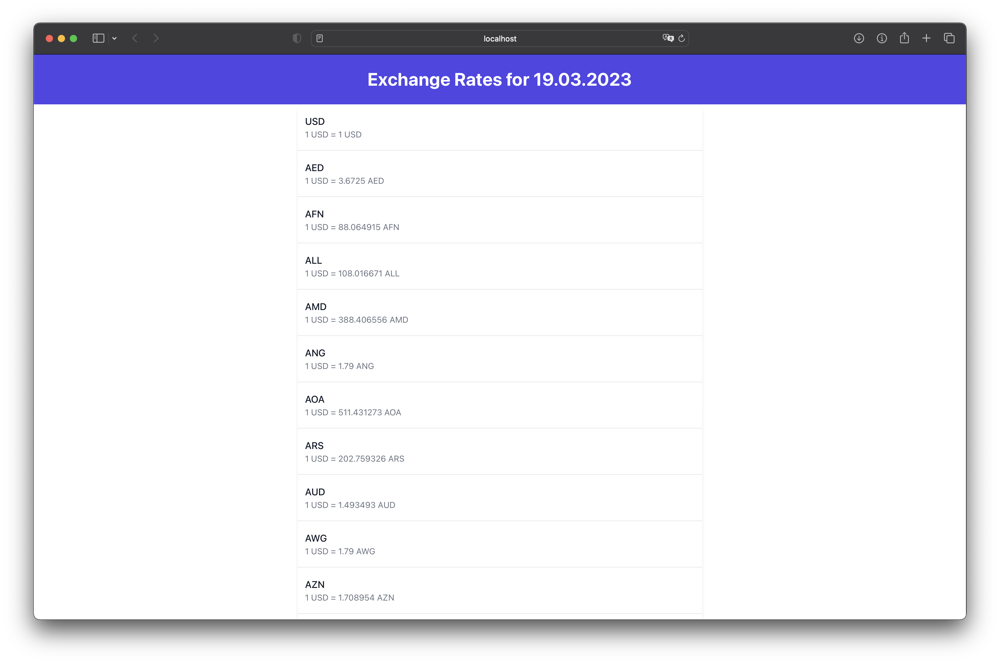

<br />
 <div align="center">
   <a href="https://github.com/Zulbukharov/exchangerate">
     
   </a>

   <h3 align="center">USD Exchange Rate Tracker</h3>

   <p align="center">
     The Exchange Rate Tracker is a simple web application that allows users to view the latest exchange rates for USD against other major currencies.
     <br />
     <br />
     <a href="https://github.com/Zulbukharov/exchangerate/issues">Report Bug</a>
     ·
     <a href="https://github.com/Zulbukharov/exchangerate/issues">Request Feature</a>
   </p>
 </div>

## Demo



## Installation

To install the Exchange Rate Tracker, simply clone this repository to your local machine and install the required dependencies.

- run postgres locally
- create `appsettings.json` and fill `ConnectionStrings` object with the credentials for `postgres`. Template is ready.

```
cp appsettings.json.example appsettings.json
```

- run this commands

```
git clone https://github.com/your-username/exchange-rate-tracker.git
cd exchange-rate-tracker/
dotnet ef database update
dotnet build
dotnet run
cd client
npm install
npm start
```
